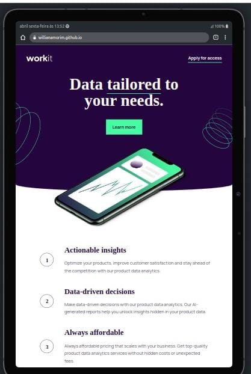
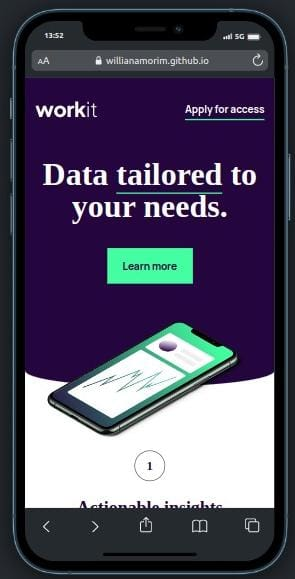

# Pagina de destino Workit

Descrição breve do que o projeto faz

## Tecnologias Utilizadas

- HTML
- CSS
- Responsividade

## Como Usar

1. Clone o repositório
2. Execute o projeto com dois cliques no `arquivo html` ou utilizando a extensão `Go Live` do VsCode

## Layout e Design

É uma página de destino somente HTML e CSS, onde pode ser personalizada para qualquer tipo de empresa e para qualquer tipo de dispositivo

## Como Contribuir

1. Clone o repositório
2. Faça as mudanças necessárias e crie um novo branch com o nome da sua funcionalidade
3. Envie um pull request

## Contato

Entre em contato comigo pelo e-mail willianamorim1@outlook.com.br ou pelo LinkedIn https://www.linkedin.com/in/willian-s-amorim/.